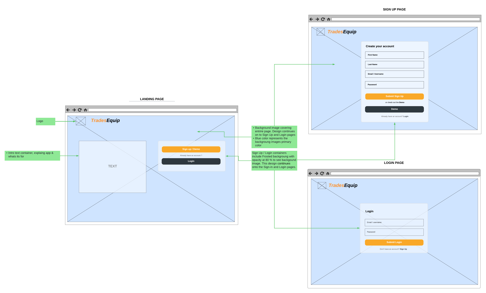
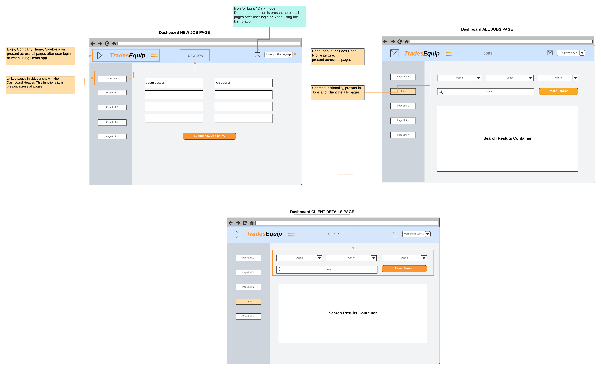
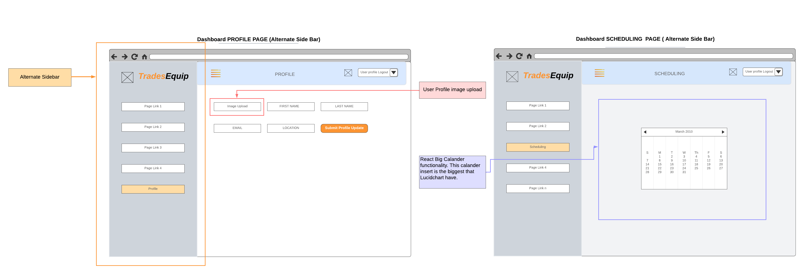
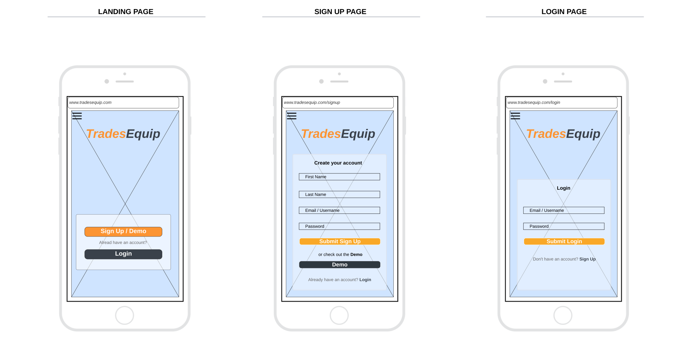
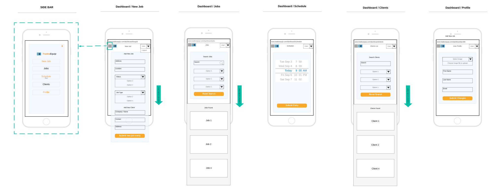

# T3A2 Full Stack App (Part-A)


## Purpose

The Tradesman Job Management application is designed to streamline and enhance the work
processes of tradesmen. It aims to address the unique challenges faced by tradesmen in 
managing their jobs, schedules, clients, and resources.

---

## Target audience

The application targets blue-collar workers such as tradesmen working in a non-office
environment such as construction sites and production lines who need a solution to
manage their work processes.

---

##  User Stories

**Job Management**
- As a tradesman, I have a new job lined up. I open the app and go to the job creation page. I fill in
  the job details such as location, type of work, materials needed, estimated time, cost, etc., and submit
  the job entry. Now, I have a digital record of my job. Over time, I update these job entries as things
  change, ensuring my job list is always current. If a job gets cancelled or completed, I can easily
  delete it from my list. I can also view my current, pending, and completed jobs, as well as filter them
  by date, location, or type of work in a search bar. This will come in handy when I need to find a specific
  job to compare details such as cost or materials needed as reference.


**Schedule Management**
- Managing my schedule is important for me as a tradesman. With the app, I can go to the calendar feature,
  select the date and time for each job, and save the job schedule. I also set reminders for my jobs, so I
  don't miss any. This way, I can organize my work and manage my time effectively.

**Client Management**
- Keeping track of my clients is essential. With the app, I can add a new client with their contact
  information and save it. I can update my clients' information as needed, ensuring it's always current.
  If a client is no longer relevant, I can easily delete them from my client list.


**User Profile**

- As a tradesman, I want to have a comprehensive and accessible profile. I open the app and navigate
  to the user profile page. Here, I can view my contact information, profile picture, and other
  personal details. If I need to update any of this information, such as changing my phone number or
  updating my profile picture, I can easily do so within the app. I also have the option to change
  my password if needed, ensuring my account remains secure. This feature allows me to maintain an
  up-to-date and accurate profile, which is essential for managing my professional image

---

## Functionality / features

- **User Registration and Authentication**: A secure login system for tradesmen to access their profiles. This includes registration, login, and password functionality. Admin will have access to the number of registered users. There's also a potential feature for user registration confirmation, which may require a background worker depending on the processing load.
- **Job Management**: Tradesmen can create, read, update, and delete (CRUD) job entries with details like job location, type of work, materials needed, estimated time, cost, etc.
- **Schedule Management**: A CRUD calendar feature, leveraging react-big-calendar, allows tradesmen to schedule their jobs, set reminders, and mark their availability.
- **Client Management**: A CRUD database of clients with their contact information, _~~**job history, and completed jobs.**~~_
- **User Profile**: A feature to view and update user details, including contact information, profile picture, and password.
- **Search and Filter**: A search bar and filter options to find specific jobs, clients, or inventory items quickly.
- **Dashboard**: A dashboard to view a summary of jobs, schedules, clients, and user profile details.

---


## Tech stack

This application is built using the MERN stack, which includes MongoDB, Express.js, React.js, and Node.js.
The following list includes but not limited to the libraries and packages used. A more comprehensive
list will be available in the final documentation for this project.

### Front-end Libraries and Packages

- **React Router**: For navigation within the application.
- **Axios**: For making HTTP requests to the back-end server from the front-end.
- **react-big-calendar**: For adding calendar features in the schedule management.

### Back-end Libraries and Packages

- **Mongoose**: For modeling and mapping MongoDB data to JavaScript.
- **bcryptjs**: For hashing and securing passwords.
- **jsonwebtoken (JWT)**: For implementing authentication and authorization.
- **express-validator**: For validating requests and creating more secure APIs.
- **dotenv**: For managing environment variables.


---

## Application Architecture Diagram


```mermaid


```

---

## Dataflow Diagram


```mermaid


```

---


## Wireframes

The following wireframes are designed to provide a visual representation of the application's user interface.
These wireframes are intended to guide the development process and may be subject to change based on project 
requirements, such as the arrangement of input text fields, buttons, and other UI elements. 

The colors light blue, light grey, and white are base colors representing the color scheme of the application.
The final application's colors will be darker and more refined and may include additional colors to enhance 
the user experience.


### Landing, Sign Up, and Login Pages




### New Job, All Jobs, and Client Details Pages




### Profile and Scheduling Pages


In addition to the primary sidebar designs shown in the application's user interface above,
The following wireframes include an alternative sidebar design. This design extends to the 
top of the page, offering a distinct aesthetic and potentially different user interaction model.
This alternate design is under consideration as a supplementary option, which may or may not be 
implemented based on project requirements.



<br>

### Mobile Landing, Sign Up, and Login Pages




### Mobile Sidebar, Dashboard, and All Pages


---

## Planning

TrelloBoard

https://trello.com/invite/b/eLI2bsdu/ATTI9b9034d37cc3056fd143c3185b5e25f427FDF11E/t3a2-full-stack-app


