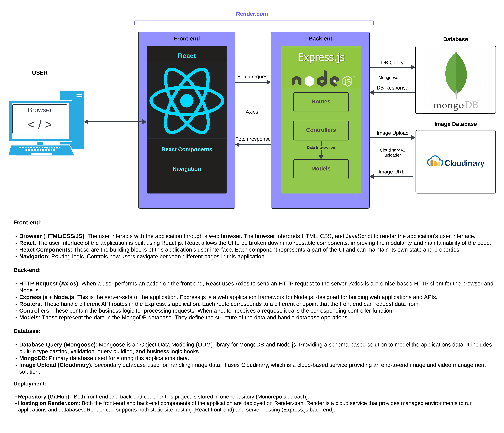
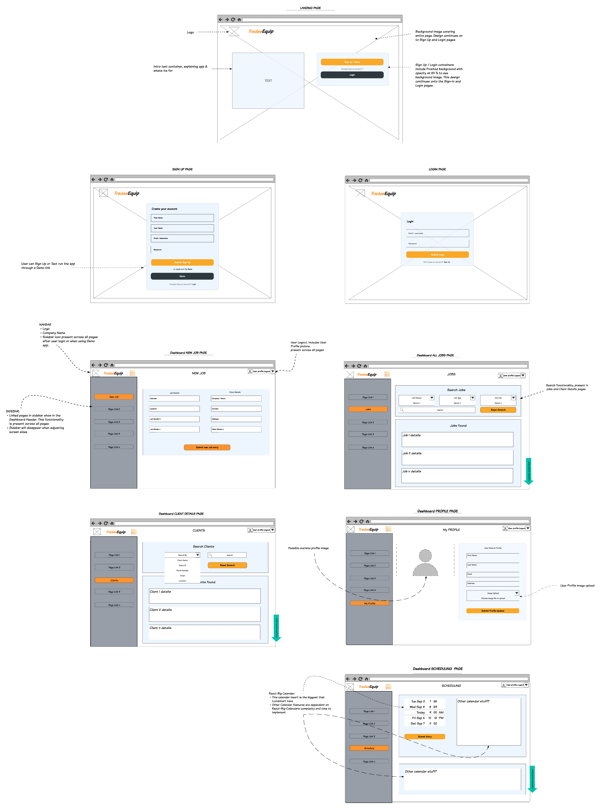
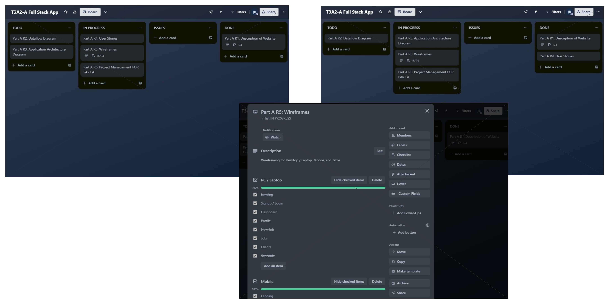

# T3A2 Full Stack App (Part-A)

[Part A Repo Link](https://github.com/SkimJazz/t3a2-a_full-stack-app/tree/main)

## Purpose

The Tradesman Job Management Application is a comprehensive solution designed to empower 
tradespersons across various industries. In the fast-paced and demanding world of trade services,
organization and efficiency are key to success. Whether you're an electrician, plumber, carpenter,
or in any other trade, managing jobs effectively is vital.

Our application aims to simplify job tracking from initial contact through to completion, allowing 
tradespersons to stay organized, save time, and focus on what they do best - mastering their trade. 
With features such as user registration and authentication, a dashboard for a quick overview, user 
profile management, search and filter options, and job, schedule, and client management, our application 
provides a one-stop solution for tradespersons to manage their work.

The purpose of this application is to streamline the process of job management for tradespersons. 
It provides a platform where tradespersons can keep track of their jobs, schedules, and clients 
efficiently. The application also allows tradespersons to update their profiles, search for specific
jobs or clients quickly, and manage their jobs and schedules effectively.

By digitizing these aspects of job management, we aim to enhance productivity, improve time management,
and ultimately increase customer satisfaction and business growth for tradespersons. Our goal is to 
make the job management process as seamless and efficient as possible, allowing tradespersons to focus
more on their work and less on administrative tasks, because let's face it, _**trademan don't like paper work**_.
This application is a step towards a more organized,
efficient, and successful future for all tradespersons.

---

## Target audience

Our Tradesman Job Management Application is specifically designed for tradespersons who are seeking a
streamlined and efficient way to manage their jobs. Our target audience includes electricians, plumbers,
carpenters, and other tradespersons across various industries.

These professionals often juggle multiple jobs at once, each with its unique requirements, schedules, 
and clients. They need a reliable and easy-to-use platform that can help them stay organized, track their
jobs, manage their schedules, and maintain their client database.

Our application is also suitable for tradespersons who are looking to save time on administrative tasks 
and focus more on their trade. With features like user registration and authentication, a comprehensive 
dashboard, user profile management, search and filter options, and job, schedule, and client management, 
our application provides a one-stop solution for their job management needs.

Furthermore, tradespersons who value the security of their data and the convenience of accessing their 
job information from anywhere will find our application particularly useful. Whether they are self-employed
or part of a larger team, our application can adapt to their needs and help them manage their work more effectively.

---

## Functionality / features

- **User Registration and Authentication**: A secure login system for tradesmen to access their profiles. This includes
  registration, login, and password functionality. Admin will have access to the number of registered users. There's also
  a potential feature for user registration confirmation, which may require a background worker depending on the processing
  load.
- **Dashboard**: A dashboard to view a summary of jobs, schedules, clients, and user profile details.
- **User Profile**: A feature to view and update user details, including contact information, profile picture, and password.
- **Search and Filter**: A search bar and filter options to find specific jobs, clients, or inventory items quickly.
- **Job Management**: Tradesmen can create, read, update, and delete (CRUD) job entries with details like job location,
  type of work, materials needed, estimated time, cost, etc.
- **Schedule Management**: A CRUD calendar feature, leveraging react-big-calendar, allows tradesmen to schedule their
  jobs, set reminders, and mark their availability.
- **Client Management**: A CRUD database of clients with their contact information

---

##  User Stories

1. **User Registration and Authentication**
  - As a tradesman, I want to register an account so that I can access the job management features.
    - Acceptance Criteria: The system allows me to register an account using my email and a password. The app communicates
      the successful registration to me in a browser alert message.
  - As a tradesman, I want to log in to my account so that I can manage my jobs.
    - Acceptance Criteria: The system allows me to log in using my registered email and password.

2. **Dashboard**
  - As a tradesman, I want to view a summary of my profile and have the ability to navigate to my jobs, schedules, and 
    clients on my dashboard so that I can get an overview of my work at a glance.
    - Acceptance Criteria: The dashboard displays a summary of my profile in addition to allowing me to choose a different
      page link for adding a new job, schedules, and viewing current jobs and client lists.

3. **User Profile**
  - As a tradesman, I want to view and update my profile details so that my contact information is always up-to-date.
    - Acceptance Criteria: The system allows me to view my profile details and update them as needed.

4. **Search and Filter**
  - As a tradesman, I want to search for specific jobs or clients so that I can find the information I need quickly.
    - Acceptance Criteria: The system provides a search bar where I can enter keywords to search for jobs or clients.
  - As a tradesman, I want to filter my jobs by different criteria so that I can easily sort and manage my work.
    - Acceptance Criteria: The system provides filter options for sorting jobs by date, location, or type of work.

5. **Job Management**
  - As a tradesman, I want to create job entries with all the necessary details so that I have a complete record of my work.
    - Acceptance Criteria: The system provides a form for creating a new job entry with fields for job location, type of work, materials needed, estimated time, cost, etc.
  - As a tradesman, I want to update my job entries as things change so that my job list is always current.
    - Acceptance Criteria: The system allows me to select a job entry and update its details.
  - As a tradesman, I want to delete job entries when a job is cancelled or completed so that my job list is accurate.
    - Acceptance Criteria: The system allows me to select a job entry and delete it.

6. **Schedule Management**
  - As a tradesman, I want to schedule my jobs and set reminders so that I never miss a job.
    - Acceptance Criteria: The system provides a calendar feature where I can schedule jobs and set reminders.
  - As a tradesman, I want to mark my availability so that I can manage my time effectively.
    - Acceptance Criteria: The system allows me to mark my availability on the calendar.

7. **Client Management**
  - As a tradesman, I want to add new clients and their contact information so that I can keep track of my clients.
    - Acceptance Criteria: The system provides a form for adding a new client with fields for their contact information.
  - As a tradesman, I want to update my clients' information as needed so that it's always current.
    - Acceptance Criteria: The system allows me to select a client and update their information.
  - As a tradesman, I want to delete clients from my list when they are no longer relevant so that my client list is accurate.
    - Acceptance Criteria: The system allows me to select a client and delete them from my list.

---

## Tech stack

This application is built using the MERN stack, which includes MongoDB, Express.js, React.js, and Node.js.
The following list includes but not limited to the libraries and packages used. A more comprehensive
list will be available in the final documentation for this project.

### Front-end Libraries and Packages

- **React Router**: For navigation within the application.
- **Axios**: For making HTTP requests to the back-end server from the front-end.
- **react-big-calendar**: For adding calendar features in the schedule management.

### Back-end Libraries and Packages

- **Mongoose**: For modeling and mapping MongoDB data to JavaScript.
- **bcryptjs**: For hashing and securing passwords.
- **jsonwebtoken (JWT)**: For implementing authentication and authorization.
- **express-validator**: For validating requests and creating more secure APIs.
- **dotenv**: For managing environment variables.

---

## Application Architecture Diagram

---

## Dataflow Diagram

---

## Wireframes

The following wireframes are designed to provide a visual representation of the application's user interface.
These wireframes are intended to guide the development process and may be subject to change based on project 
requirements, such as the arrangement of input text fields, buttons, and other UI elements. The final application's
colors will be more refined and may include additional colors to enhance the user experience.

### Wireframe Desktop and Laptop application layout

 

### Wireframe Tablet application layout

 

### Wireframe Mobile application layout

---

## Planning and Project Management - PART A

### Week 1 planning and progress

The first week of the project was dedicated to planning and setting up the project.
The following tasks were worked on during the first week: Requirements 1 and 4, including project planning.

### Week 2 planning and progress

Wireframes and user stories were created during the second week.

### Week 3 planning and progress

Finalizing the DFD in addition to the Functionality and Features section of the README file.

